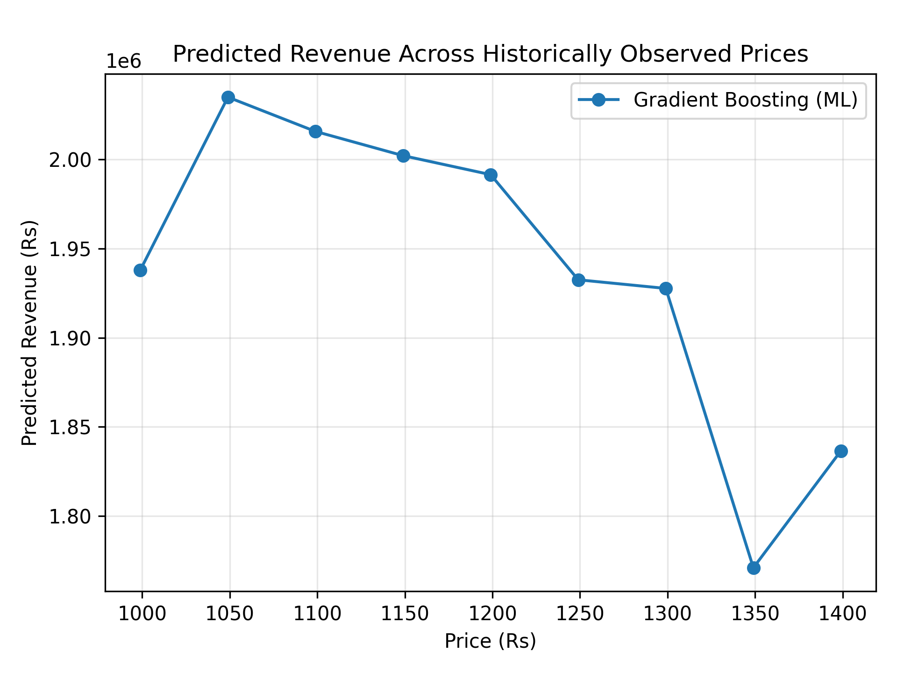
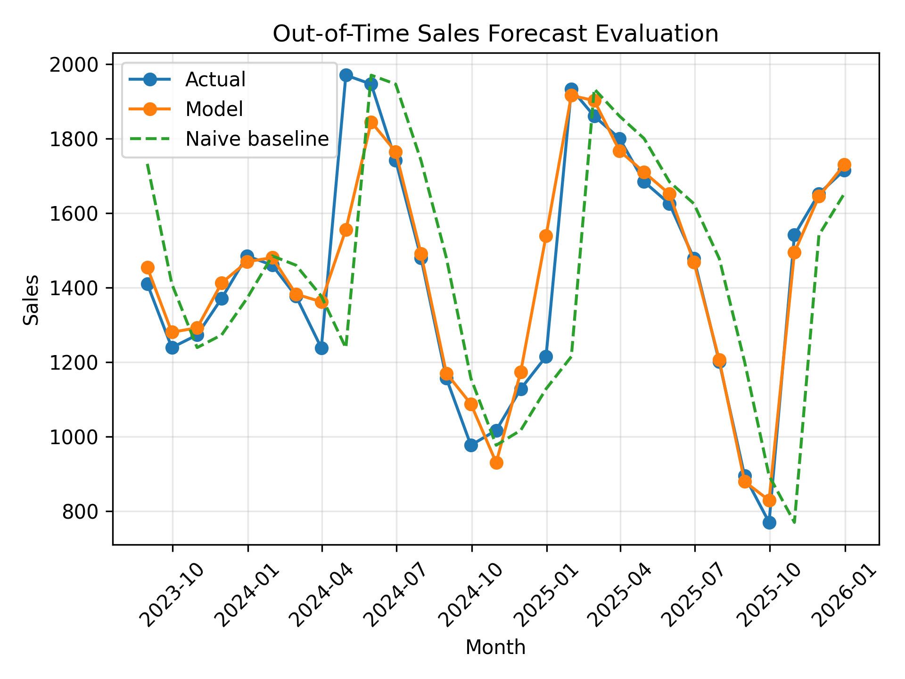
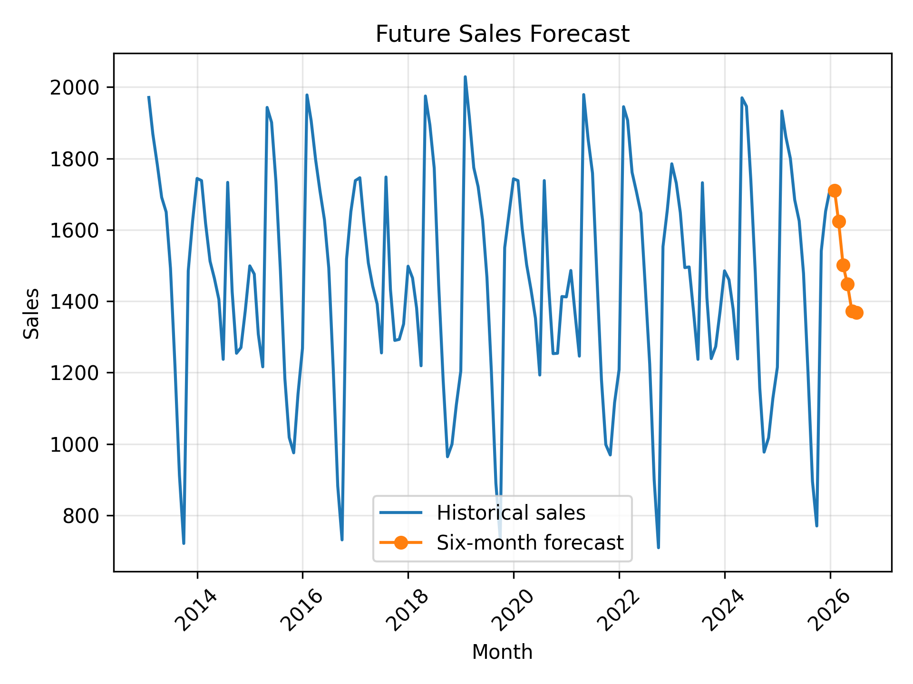

# Product Price Optimisation and Sales Forecasting

A reproducible machine learning project that estimates revenue-maximising prices and forecasts future product sales from historical price, demand, and monthly time-series data.

> Developed from a project submission for the **AI Development Associate programme at NIELIT Chennai**. The included dataset is **synthetic demonstration data** and the results are not commercial pricing recommendations.



## Project overview

The project addresses two related business questions:

1. **Price optimisation:** How does price affect predicted demand and which historically observed price produces the highest predicted revenue?
2. **Sales forecasting:** How accurately can future monthly sales be estimated from lagged demand, rolling averages, trend, and seasonal patterns?

The workflow includes data validation, feature engineering, chronological model evaluation, comparison with a naïve forecasting baseline, price-scenario analysis, and a recursive six-month sales forecast.

## Key results on the synthetic dataset

| Task | Model | MAE | RMSE | R² |
|---|---|---:|---:|---:|
| Price–demand modelling | Gradient Boosting | 26.55 | 35.19 | 0.987 |
| Sales forecasting | Random Forest | 60.12 | 108.63 | 0.884 |
| Sales baseline | Previous-month forecast | 199.14 | 284.54 | 0.204 |

For the April 2026 price scenario, the machine-learning model selected an observed candidate price of **Rs 1,049**, with predicted demand of approximately **1,940 units** and predicted revenue of approximately **Rs 2.04 million**.

The sales model materially outperformed the previous-month baseline on the held-out chronological test period.

## Forecast evaluation



The final portion of the dataset is reserved for out-of-time testing. This preserves chronological order and provides a more realistic evaluation than a random train–test split.

## Six-month forecast



| Month | Forecast sales |
|---|---:|
| January 2026 | 1,710 |
| February 2026 | 1,623 |
| March 2026 | 1,501 |
| April 2026 | 1,448 |
| May 2026 | 1,372 |
| June 2026 | 1,368 |

## Methodology

### Data validation

- Validates the required `Months`, `Price`, and `Demand` fields
- Accepts `Product_Code` as an optional identifier
- Parses the supplied `DD-MM-YYYY` dates
- Removes incomplete, invalid, and duplicate observations
- Flags demand outliers without silently deleting them

### Price optimisation

- Adds trend and cyclic calendar features
- Uses a chronological holdout period for evaluation
- Trains a Gradient Boosting demand model
- Optionally trains a TensorFlow neural network when TensorFlow is installed
- Compares models using MAE, RMSE, and R²
- Evaluates predicted revenue only at historically observed prices

### Sales forecasting

- Creates 1-, 2-, 3-, 6-, and 12-month lag features
- Creates leakage-safe rolling means from previous observations
- Adds trend and seasonal sine/cosine features
- Trains a Random Forest regression model
- Compares the model with a previous-month naïve baseline
- Produces a recursive six-month forecast

## Repository structure

```text
.
├── price_optimization_sales_forecasting.py
├── price_demand_sales.csv
├── requirements.txt
├── price_optimisation_comparison.png
├── sales_forecast_evaluation.png
├── future_sales_forecast.png
└── README.md
```

The three selected charts are included at repository level for README display. The Python program creates the complete set of CSV, JSON, and image results inside `outputs/` when it runs.

## Installation

Clone the repository and enter the project directory:

```bash
git clone https://github.com/mdzamirhossain/product-price-optimization-sales-forecasting.git
cd product-price-optimization-sales-forecasting
```

Create and activate a virtual environment:

```bash
python3 -m venv .venv
source .venv/bin/activate
```

Install the dependencies:

```bash
python3 -m pip install --upgrade pip
python3 -m pip install -r requirements.txt
```

## Run the project

```bash
python3 price_optimization_sales_forecasting.py
```

The program prints the model metrics, price recommendation, and sales forecast in the terminal and saves the result files inside `outputs/`.

If TensorFlow is unavailable, the program records the neural-network comparison as skipped and completes the remaining analysis normally.

## Tech stack

Python · pandas · NumPy · scikit-learn · TensorFlow/Keras · Matplotlib

## Limitations and responsible use

- The included data are synthetic and intentionally contain learnable price and seasonal patterns.
- Strong performance on synthetic data does not establish production readiness.
- A real deployment would require genuine unseen business data, product costs, promotions, stock availability, holidays, competitor pricing, market conditions, monitoring, and periodic retraining.
- The generated price recommendation is an academic demonstration, not financial or commercial advice.

## Author

**MD Zamir Hossain**  
[GitHub profile](https://github.com/mdzamirhossain)
